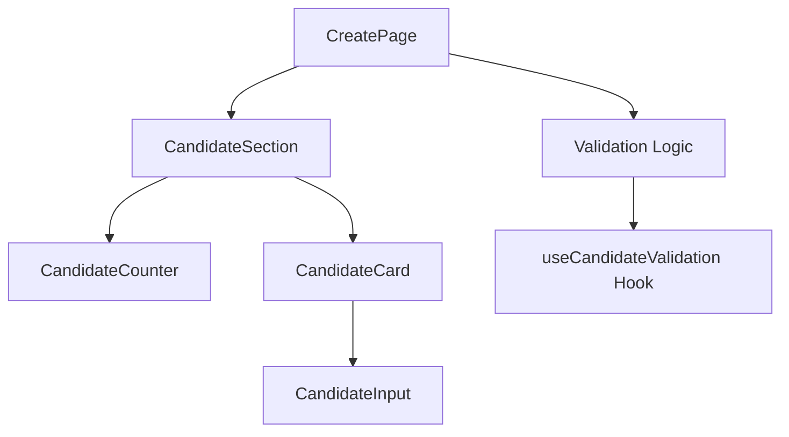
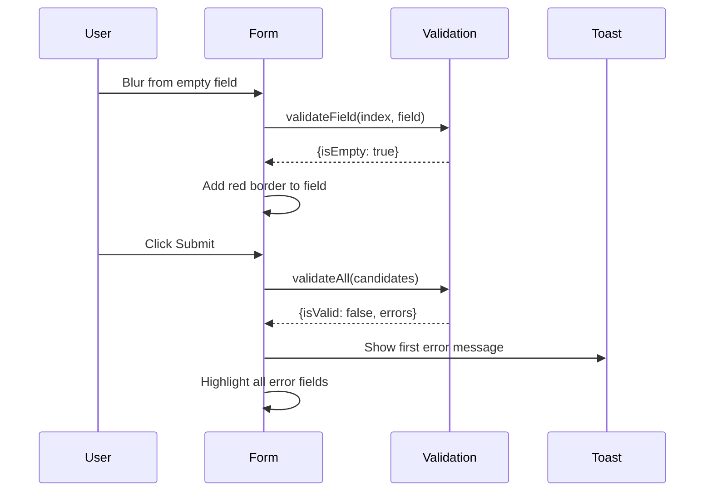

# Design Document: Dynamic Candidate Management

## Overview

This design enhances the existing candidate management functionality in the election creation form (`CreatePage`). The current implementation already supports basic add/remove/edit operations. This design focuses on adding missing features: unique name validation, visual candidate counter, improved error states with real-time feedback, and mobile responsiveness improvements.

## Architecture

The enhancement follows the existing component architecture pattern in the Agora-Blockchain client:



The design extracts candidate-related UI into a dedicated `CandidateSection` component while keeping the state management in the parent `CreatePage` to maintain the existing form submission flow.

## Components and Interfaces

### 1. CandidateSection Component

A new component that encapsulates the candidate list UI, counter, and add button.

```typescript
// Location: Agora-Blockchain/client/app/create/components/CandidateSection.tsx

interface CandidateSectionProps {
  candidates: Candidate[];
  validationErrors: CandidateValidationErrors;
  onAddCandidate: () => void;
  onRemoveCandidate: (index: number) => void;
  onUpdateCandidate: (index: number, field: keyof Candidate, value: string) => void;
  onFieldBlur: (index: number, field: keyof Candidate) => void;
}

interface Candidate {
  name: string;
  description: string;
}

interface CandidateValidationErrors {
  duplicateIndices: Set<number>;  // Indices of candidates with duplicate names
  emptyFields: Map<number, Set<keyof Candidate>>;  // Map of index to empty field names
}
```

### 2. CandidateCard Component

Renders individual candidate entry with validation states.

```typescript
// Location: Agora-Blockchain/client/app/create/components/CandidateCard.tsx

interface CandidateCardProps {
  candidate: Candidate;
  index: number;
  isDuplicate: boolean;
  emptyFields: Set<keyof Candidate> | undefined;
  onRemove: () => void;
  onUpdate: (field: keyof Candidate, value: string) => void;
  onBlur: (field: keyof Candidate) => void;
}
```

### 3. CandidateCounter Component

Displays candidate count with visual feedback.

```typescript
// Location: Agora-Blockchain/client/app/create/components/CandidateCounter.tsx

interface CandidateCounterProps {
  count: number;
  minimum: number;
}
```

### 4. useCandidateValidation Hook

Custom hook for validation logic.

```typescript
// Location: Agora-Blockchain/client/app/hooks/useCandidateValidation.ts

interface ValidationResult {
  isValid: boolean;
  errors: CandidateValidationErrors;
  errorMessages: string[];  // Array of user-facing error messages
}

function useCandidateValidation(candidates: Candidate[]): ValidationResult;
```

## Data Models

### Candidate Interface (existing, unchanged)

```typescript
interface Candidate {
  name: string;
  description: string;
}
```

### CandidateValidationErrors (new)

```typescript
interface CandidateValidationErrors {
  duplicateIndices: Set<number>;
  emptyFields: Map<number, Set<keyof Candidate>>;
}
```

### Validation Error Messages (constants)

```typescript
const VALIDATION_MESSAGES = {
  MIN_CANDIDATES: "Minimum 2 candidates required",
  EMPTY_FIELDS: "All candidates need name & description",
  DUPLICATE_NAMES: "Candidate names must be unique"
} as const;
```

## Error Handling

### Real-time Validation Strategy

1. **On Field Blur**: Validate individual field for empty state, highlight with red border if empty
2. **On Name Change**: Check for duplicates across all candidates, highlight duplicates immediately
3. **On Submit**: Run full validation, display toast with first error message, prevent submission

### Visual Error States

| State | Border Color | Background |
|-------|-------------|------------|
| Normal | `border-gray-300` | None |
| Error (empty/duplicate) | `border-red-500` | `bg-red-50` |
| Focus | `border-indigo-500` | None |

### Error Display Flow



## Testing Strategy

### Unit Tests (Optional)

1. **useCandidateValidation Hook**
   - Returns valid when 2+ candidates with unique names and filled fields
   - Returns duplicateIndices when names match (case-insensitive)
   - Returns emptyFields when name or description is empty
   - Returns correct error messages array

2. **CandidateCounter Component**
   - Displays correct count
   - Shows warning color when below minimum
   - Shows success color when at/above minimum

### Integration Tests (Optional)

1. **CandidateSection**
   - Add candidate creates new entry with animation
   - Remove candidate removes entry with animation
   - Duplicate names highlight both fields
   - Empty field on blur highlights field

### Manual Testing Checklist

- [ ] Add candidate button works
- [ ] Remove candidate button works
- [ ] Counter updates correctly
- [ ] Duplicate name validation shows error
- [ ] Empty field validation shows error on blur
- [ ] Form submission blocked with validation errors
- [ ] Mobile layout is usable
- [ ] Animations are smooth

## UI/UX Specifications

### Candidate Counter Design

```
┌─────────────────────────────────────────┐
│ Candidates          [2/2 minimum] [+ Add]│
└─────────────────────────────────────────┘
```

- Counter shows `X/2 minimum` format
- Warning color (amber) when < 2
- Success color (green) when >= 2

### Mobile Responsiveness

- Stack candidate name/description vertically on screens < 640px
- Full-width inputs on mobile
- Minimum touch target 44x44px for buttons
- 16px minimum font size on inputs to prevent iOS zoom

### Animation Specifications

Using Framer Motion (already in project):

```typescript
// Add animation
const addVariants = {
  initial: { opacity: 0, y: -20, height: 0 },
  animate: { opacity: 1, y: 0, height: "auto" },
  exit: { opacity: 0, x: -20, height: 0 }
};

// Transition config
const transition = {
  duration: 0.3,
  ease: "easeOut"
};
```

### Error State Styling

```typescript
// Input with error
const inputErrorClasses = "border-red-500 bg-red-50 focus:border-red-500 focus:ring-red-500";

// Input normal
const inputNormalClasses = "border-gray-300 focus:border-indigo-500 focus:ring-indigo-500";
```

## File Structure

```
Agora-Blockchain/client/app/
├── create/
│   ├── page.tsx                    # Modified - uses new components
│   └── components/
│       ├── CandidateSection.tsx    # New - main candidate UI
│       ├── CandidateCard.tsx       # New - individual candidate
│       └── CandidateCounter.tsx    # New - count display
├── hooks/
│   └── useCandidateValidation.ts   # New - validation logic
└── helpers/
    └── candidateValidation.ts      # New - validation constants/utils
```

## Implementation Notes

1. **Preserve Existing Behavior**: The current form submission logic in `createElection` should remain largely unchanged. The new validation hook will provide the same checks but with additional duplicate detection.

2. **State Location**: Keep `candidates` state in `CreatePage` to maintain the existing contract interaction flow. Pass down via props.

3. **Animation Library**: Use existing `framer-motion` with `AnimatePresence` for enter/exit animations.

4. **Styling Approach**: Use existing TailwindCSS classes. No new CSS files needed.

5. **Toast Notifications**: Continue using `react-hot-toast` for error messages on submit.
