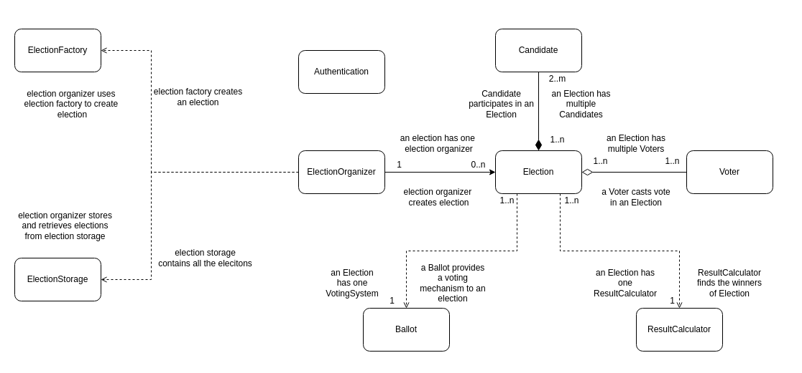
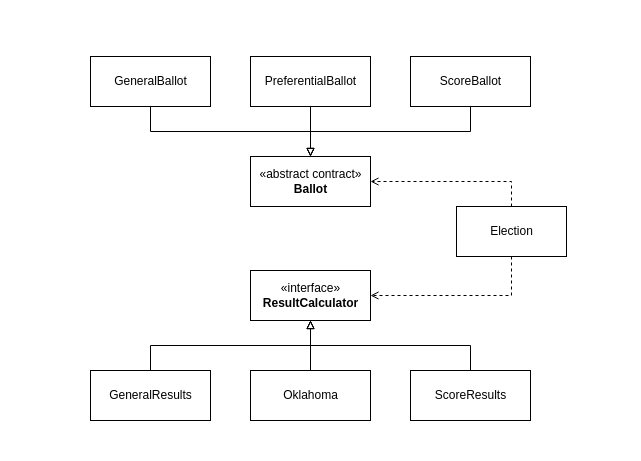

    
       
    
      
    
<h1>GSOC'22 - <b>Sreeniketh Madgula</b></h1>

    <!-- 

 -->
    
<h2><b>Agora Blockchain Project</b></h2>

      

Organization: [**AOSSIE**](https://aossie.gitlab.io)
-

Project Name: [**Agora Blockchain**](https://gitlab.com/aossie/agora-blockchain/-/tree/develop)
-

Contributor: [**Sreeniketh Madgula**](https://gitlab.com/sreenikethMadgula)
-

AOSSIE Project Description: [**Here**](https://gitlab.com/aossie/agora-blockchain/-/blob/develop/DOCUMENTATION.md#about-agora-blockchain)
-

Mentors: [**Raj Ranjan**](https://gitlab.com/rranjan01234)
-

 

Links
-
- Project - https://gitlab.com/aossie/agora-blockchain
- Project is live on - https://agorablockchain21.herokuapp.com

 

# Summary

[**Agora**](https://gitlab.com/aossie/Agora) is a library of voting data structures and algorithms for counting votes in different types electoral systems, like `Moore's` for `General`, `Oklahoma` for `Preferential` etc. 
Some of these voting algorithms are already implemented by **AOSSIE** in a centralized manner using Scala as their backend. Our vision is to take these algorithms on a decentralized platform, so that, crucial votes of the voters could not be tampered with by the admins, hackers, or anyone with access to the database. Blockchain technology would make the ballots immutable and hence more secure. 

The previous version of the decentralized application had only one voting algorithm, which would calculate the results of a **General Ballot** where each voter could vote for only 1 candidate.
The proposal in brief, was to extend support to various ballots and corresponding result computation algorithms of the **Majoritarian electoral system**.

# Refining Smart Contracts

The existing design of the smart contracts satisfied the use case at the time. But it wasn't extensible, i.e., adding new features was not easy.

The smart contracts would have had to be modified each time a feature would have to be suppported, which would result in frequent breaking changes.

How this affects the application
-
A smart contract is deployed using its **ABI** (**A**pplication **B**inary **I**nterface) which is generated after it is compiled. **ABI** defines the methods and structures used to interact with the binary contract, just like **API** does but on a lower-level.

Every time a smart contract is changed, it would have to be redeployed for the application to accomodate these changes.
This would require compiling the contracts to reflect changes in the **ABI**.

So, if a smart contract is modified for every new feature, this would mean deploying it very frequently. This is highly inefficient.

How it has improved
-
The current architecture, as proposed, has been built according to [**SOLID**](https://www.digitalocean.com/community/conceptual_articles/s-o-l-i-d-the-first-five-principles-of-object-oriented-design) design principles.

The contracts now are along the lines of these principles and also are **loosely coupled**. Implementing a new feature is achieved by just adding a file to the project.
The existing contracts need not be compiled and redeployed.

To support a new ballot with this design, only that specific `Ballot` contract would need to be deployed. Likewise for a new result computation algorithm, only a `ResultCalculator` contract would need to be deployed.

# The new architecture with **SOLID** Principles

## Object Model

The object model of the project looks like:

The `Authentication` contract is responisible for authorizing users and creating election organizers.

`Candidate` is implemented as a structure within the `Election` contract. Hence, the composition.

The `ElectionOrganizer` contract facilitates the creation of elections with the use of the `ElectionFactory` contract.

The `Election` contract has dependencies on `Ballot` and `ResultCalculator`. 
These dependencies are injected during the creation of an through the `ElectionFactory`.

The diagram showing how `Election`, `Ballot` and `ResultCalculator` are related:

# Workflow

## Creating a user

The `Authentication` contract is used to create users using the `createUser()` function:

    function createUser(ElectionOrganizer.OrganizerInfo memory _organizerInfo) public

## Creating an Election

Only an authorized user can act as an election organizer to create elections.

The `createElection()` function of the `ElectionOrganizer` contract is called:

    function createElection(Election.ElectionInfo memory _electionInfo,uint _ballotType, uint _resultCalculatorType) public onlyOrganizer

This in turn calls the `getElection()` function of the `ElectionFactory` contract:

    function getElection(Election.ElectionInfo memory _electionInfo, uint _ballotType, uint _resultCalculatorType, address _electionOrganizer, address _electionOrganizerContract) external onlyOrganizerContract returns(Election)

The `ballotType` and `resultCalculatorType` are matched the corresponding `Ballot` and `ResultCalculator` are created and passed as parameters to the constructor of the `Election` contract. The working of this contract is similar to the working of a traditional factory function.

Using dependency injection, the `Ballot` and `ResultCalculator` in the `Election` contract dependecies are handled.

The address of the `Election` created is stored in the state `ElectionStorage` contract so that it can be retrieved later.

## Adding Candidates

Only the **corresponding election organizer** is allowed to add candidates to an election.
i.e., only the authorized user who initially created the election is allowed to add candidates.

The `addCandidate()` function of the `ElectionOrganizer` contract is called:

    function addCandidate(Election _election, Election.Candidate memory _candidate)public onlyCorrespondingOrganizer

This in turn calls the `addCandidate()` function of the `Election` contract, which updates the state to include this candidate.

## Voting in an election 

For open elections, any public address on the blockchain network is allowed to cast votes, whereas for invite-based elections, the voting user must be authorized.

The `castVote()` function of the `Voter` contract is called:

    function castVote(Election _election,uint _candidateID, uint _weight) public

This in turn calls the `vote()` function of the `Election` contract, which is defined as follows: 

    function vote(address _voter, uint _candidateID, uint weight) external {
        require(getStatus() == Status.active, "Election needs to be active to vote");
        ballot.vote(_voter,_candidateID, weight);
        voterCount++;
        emit VoteCasted(address(ballot),candidateWithID[_candidateID],weight);
    }

The `vote()` function of the corresponding `Ballot` is called by `ballot.vote()`.

## Declaring results

Once an election ends, anyone can call the `getResult()` function of the `Election` contract:

    function getResult() external returns(uint[] memory){
        require(getStatus() == Status.closed, "Results are declared only after the election ends");
        if (resultDeclared == false) {
            winners = resultCalculator.getResult(ballot, voterCount);
            resultDeclared = true;
            emit ListWinners(winners);
            return winners;
        }
        else {
            return getWinners();
        }
    }

The `getResult()` function of the corresponding `ResultCalculator` is called by `resultCalculator.getResult()`.

## Permissions and Constraints

Function modifiers are implemented to regulate the access to functions.

`onlyOrganizer` restricts access only to authorized users, i.e., users that are authenticated by BrightID.

`onlyOrganizerContract` restricts the function to be called only from the `ElectionOrganizerContract`.

`onlyCorrespondingOrganizer` ensures that the function is being called by the organizer that created the election.

There are some additional constraints implemented associated with the status of the election:
- Candidates can be added only if the status is `pending`
- Votes can be casted only if the status is `active`
- Results can be declared only if the status is `closed`

The current status of the election depends on the timestamp of the current block - `block.timestamp`, and the `startDate` and `endDate` of the election.

# Phases of development (GSoC 2022)

## Community Bonding Period (May 20 - June 12)

The interactions during the community bonding period were primarily about the weekly meeting schedules, modes of communication, and the responsibilities of my fellow contributor Kirti and I.
We discussed about the history of the project and its Web2 counterpart - **Agora**.

Some of the minor changes in the plan proposed were discussed.

The project was broken down into tasks which spanned across the two phases as follows:

- Phase 1
    - Client side
        - Get rid of Drizzle library
    - Backend side
      - Restructure with SOLID principle
      - Integrating voting algorithms (for testing)
      - KYC integration - see PoH or BrightID
      - Open (KYC required by default) and Invite based election (inviting with account address)
- Phase 2
    - Client siide
        - Invite/Open selection and email integration for sending invites
        - Voting algorithms dropdown
        - Submit vote modal
        - Algorithm specific results
        - KYC steps
    - Backend side
        - Add more voting algorithms

## Phase 1 (June 13 - July 29)

My tasks for phase one:

- [x] Restructure the code base with **SOLID** principles
- [x] Integrating voting algorithms 
  - The working of the new architecture was tested thoroughly for functionality
- [x] Implement different types of ballots

Challenges and Improvisations
- Initially, the contracts were implemented such that every contract would be deployed when a new election is created. But this was inefficient. 
- This was discussed with the mentor and issue was resolved to improve efficiency in the code. Only the `Election` and associated dependencies - the specific `Ballot` and `ResultCalculator` - are deployed for every new election.
- `Candidate` was a contract initially. However, after the suggestion from the mentor, it was decided to get rid of the contract and reduce it to a struct in the `Election` contract; a candidate does not have any functionality to have a seperate contract.

## Phase 2 (July 30 - September 12)

My tasks for phase two:

- [x] Continue implementing smart contracts and test functionality
- [x] Work on smart contracts to support calls from frontend
  - Additional requirements from frontend fulfilled
- [x] Implement election factory
  
### Election Factory
The creation of election required deploying the specific `Ballot` and `ResultCalculator` from the frontend and then pass the addresses to the constructor of `Election`.
But after discussion with the mentor and my fellow contributor, it was decided that it would be better to deploy from backend.
So I proposed to implement an `ElectionFactory`.
The contract injects `Ballot` and `ResultCalculator` dependencies into the constructor of the `Election` contract.

- [x] Added `Oklahoma` algorithm and tested functionality
- [x] Made required addidtions and modifications to `ElectionStorage`

Tested entire functionality with both implemented algorithms, working of `ElectionStorage` and `ElectionFactory`.

Improved the structure such that only one contract is deployed from the frontend - `Authentication` 

All the other contracts are deployed automatically from the backend. 
To interact with these, the addresses of the contracts are required along with the ABI. The ABI is obtained by compiling the contract.
The addresses of required contracts are available from within the other contracts as follows
- `ElectionOrganizer` from `Authentication`
- `ElectionStorage` and `ElectionFactory` from `ElectionOrganizer`
- `Election` from `ElectionOrganizer` and `ElectionStorage`
- specific `Ballot` and `ResultCalculator` from `Election`

## Post Coding Period

All the set goals were met during the stipulated time in the coding phases. 
The remaining tasks are of documentation

Additional voting algorithms can be added now with ease.

# Challenges

1. **Inefficient deploying of contracts** - Initially, it felt right theoretically to implement contracts similar to classes - my understanding was that like how a new instance of a class is created, a smart contract could be deployed along with its dependencies. But it was expensive to redeploy some contracts. After taking advise from the mentor, the issue was resolved smoothly. The contracts didn't have any changes, and so they could be reused.
2. **Implementing different ballots** - I spent a significant amount of time trying to think of what abstractions I could make for ballots. Solidity does not support passing `mapping` as a function parameter. So I had to abstract how I was retrieving vote count for different type of elections. `GeneralBallot` and `ScoreBallot` are straightforward - every candidate receives a votes with the same weight and could be added directly. But for `PreferenceBallot`, candidates gets votes in different preferences. So the abstraction to be made was that the way of retrieving votes from the ballot, i.e., `getVoteCount()` is implemented in different ways for each ballot. 

# Acknowledgement

I would like to extend my gratitude to my mentor **Raj Ranjan** for his constant support and guidance. I found it really helpful to discuss with him when I was stuck at various points while developing.

I would like to thank **AOSSIE** for providing me the opportunity of being a contributor to the **Agora Blockchain** project.

I would also like to thank my fellow developer **Kirti Lodha** for her constant support. It was great collaborating and talking through the features and their implementation with her.

# Merge Requests

1. [Merge request !36](https://gitlab.com/aossie/agora-blockchain/-/merge_requests/36) - Base of new architecture ready. **Merged**
   - Implemented 3 different ballots and a `Ballot` abstract contract
   - `GeneralBallot`, `PreferenceBallot`, `ScoreBallot`
   - Added events and function modifiers
   - Changed the implementation of candidates from a seperate contract to a structure within `Election` contract

2. [Merge request !39](https://gitlab.com/aossie/agora-blockchain/-/merge_requests/39) - Ready for integration with frontend **Merged**
   - Implemented `ElectionFactory`
   - Completed implementation of `ElectionStorage`
   - Implemented `Oklahoma` algorithm
   - Made deployment easy; only one contract to be deployed from frontend